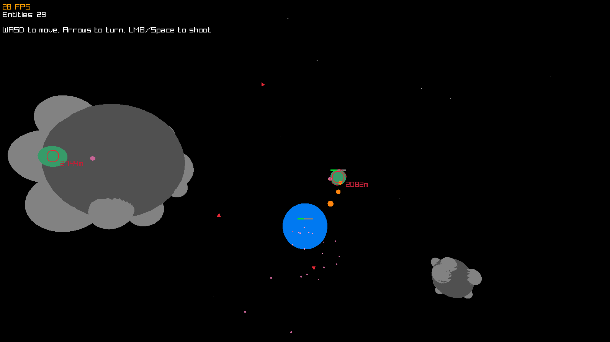

# 🚀 3D Space Shooter

A fast-paced 3D space shooting game built using [raylib](https://www.raylib.com/) and [entt](https://github.com/skypjack/entt). Dodge asteroids, shoot enemies, and survive waves in an immersive starfield arena.

## 🎮 Features

- 🌌 Fully 3D space environment
- 🧠 ECS architecture using `entt`
- 🔫 Player and enemy shooting with accurate aim assist
- 💥 Real-time collisions, HP, and regeneration
- 🌟 Custom shaders for lighting effects  
- 🚀 Dynamic camera for realistic flight simulation 
- 🪐 Asteroid spawning and debris effects

## 🕹️ Controls

| Action         | Key |
|----------------|-----|
| Move           | `W`, `S` |
| Rotate (pitch/yaw/roll) | Arrow keys, `A`, `D` |
| Shoot          | `Space` or `Left Mouse Button` |
| Restart        | `R` |

## 📸 Snapshots

### Gameplay View


### Enemy Lock-on and Targeting


### Game Over Screen


## Getting Started

### Prerequisites

- C++ compiler (supporting C++17)
- linux or equivalent environment (macos | windows wsl)

### Installation
```bash
git clone https://github.com/stanX19/ShootingGame3D.git shooting_game_3d
cd shooting_game_3d
```

### Build and run
```bash
make
```
By default `make` is `make run`

## 🛠️ Project Structure

Source
- `main.cpp` - Entry point, handles game loop
- `utils.cpp` - Vector and helper functions
- `srcs/classes/renderer.cpp` - All rendering logic, shaders, UI overlays
- `srcs/systems/*` - ECS systems like movement, collisions, shooting

Headers
- `headers/components.hpp` - All ECS components like Position, HP, Weapon, etc.
- `shoot_3d.hpp` - Main header file
