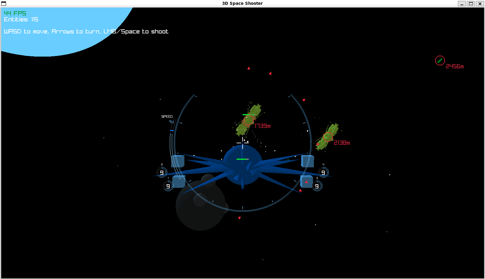
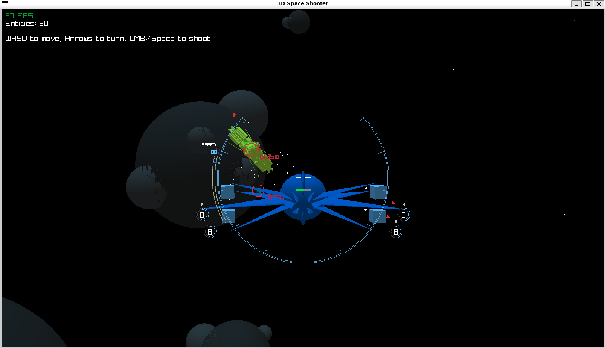
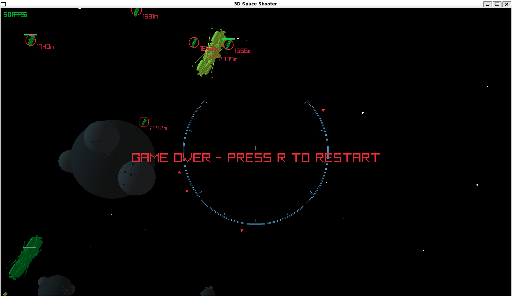

# 🚀 3D Space Shooter

A fast-paced 3D space shooting game built using [raylib](https://www.raylib.com/) and [entt](https://github.com/skypjack/entt). Dodge asteroids, shoot enemies, and survive waves in an immersive starfield arena.

## 🎮 Features

- Fully 3D space environment
- ECS architecture using `entt`
- Player vs enemy shooting with accurate aim assist
- Real-time collisions, explosions, and accurate physics
- Custom shaders for lighting effects
- Intuitive and informative in-game HUD
- Multiple weapons available
- Varied enemy types with unique behaviors
- Dynamic camera for realistic flight simulation
- Asteroid spawning and debris effects

## 🕹️ Controls

| Action         | Key |
|----------------|-----|
| Move           | `W`, `S` |
| Rotate (pitch/yaw/roll) | Arrow keys, `A`, `D` |
| Shoot          | `Space` or `Left Mouse Button` |
| Look Back      | `Shift` |
| Restart        | `R` |

## 📸 Snapshots

### Gameplay View


### Intense Shooting


### Game Over Screen


## Getting Started

### Prerequisites

- C++ compiler (supporting C++17)
- linux or equivalent environment (macos | windows wsl)

### Installation
```bash
git clone https://github.com/stanX19/ShootingGame3D.git shooting_game_3d
cd shooting_game_3d
```

### Build and run
```bash
make
```
By default `make` is `make run`

## 🛠️ Project Structure

```
headers/						// Structs, classes, and function declarations  
includes/						// Third-party libraries: raylib, entt  
main/main.cpp					// Game entry point and main loop  
srcs/
  └── components/				// Component utility functions  
  └── entities/					// Entity creation and setup  
  └── systems/					// ECS systems (e.g. movement, shooting)  
  └── utils/					// Helper and utility functions  
  └── classes/
        ├── model_manager.cpp   // Model loading and caching  
        └── renderer.cpp        // Rendering, UI, and shader logic  
shaders/						// GLSL shader files  
assets/models/					// 3D models used in the game  
assets/snapshots/				// Screenshots and visuals  
tests/							// Unit tests
```
