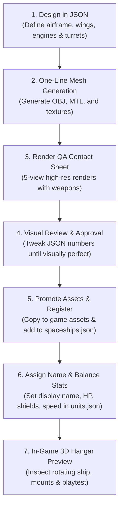

# Spaceship Designer Handbook: Zero-Code Creation & Balancing Guide

This handbook is a complete, copy-paste-ready guide for **game designers and 3D artists** to create, preview, balance, and integrate brand-new spaceships into **3D Space Shooter** without modifying or compiling any C++ engine code.

The entire asset pipeline is **100% JSON-driven**: you describe the ship's proportions, wings, engines, and weapon mounts in JSON, run automated CLI tools to generate the 3D model and multi-angle QA renders, balance its stats, and preview it live in the 3D Hangar.

---

## The 6-Step Designer Workflow



---

## Step 1: Design the Ship in JSON

You can design your ship by creating a working catalog file (for example, `scratch/my_ship_catalog.json`) or directly in [`assets/config/spaceships.json`](file:///d:/Users/user/GameProjects/shooting_game_3d/project/assets/config/spaceships.json).

### 1.1 Complete Annotated JSON Template

Copy and paste this template into your working JSON catalog:

```json
{
  "schemaVersion": 1,
  "defaults": {
    "turretRadius": 0.25,
    "barrelRadius": 0.25,
    "barrelLength": 3.25,
    "traverseHalfAngleDegrees": 8.0,
    "mountAttachment": {
      "preferredTakeoffAngleDegrees": 30.0,
      "minimumTakeoffAngleDegrees": 25.0,
      "maximumTakeoffAngleDegrees": 40.0,
      "directBlisterGapScale": 1.8,
      "distanceWeight": 0.35,
      "angleWeight": 1.0,
      "blisterRadiusScale": 1.35
    }
  },
  "ships": {
    "heavy_gunboat": {
      "modelPath": "assets/Models/spaceships/heavy_gunboat/spaceship_heavy_gunboat.obj",
      "seed": 4501,
      "design": {
        "propulsionLayout": "wing_nacelles",
        "propulsionPlacement": "auto",
        "targetAcceleration": 1.25,
        "endurance": 1.0,
        "armorMassScale": 1.1,
        "engineTechnology": 1.0,
        "moduleClearance": 0.14,
        "hardSurfaceBias": 0.75,
        "weaponLayout": {
          "placement": "auto",
          "coverage": "forward",
          "symmetry": "bilateral",
          "batteryStyle": "integrated",
          "turretCount": 4,
          "minimumSeparationScale": 1.30,
          "capabilities": [
            {
              "turretRadius": 0.25,
              "barrelRadius": 0.25,
              "barrelLength": 3.25,
              "traverseHalfAngleDegrees": 8.0,
              "supportWidth": 0.58,
              "supportHeight": 0.44,
              "socketHeight": 0.22
            },
            {
              "turretRadius": 0.25,
              "barrelRadius": 0.25,
              "barrelLength": 3.25,
              "traverseHalfAngleDegrees": 8.0,
              "supportWidth": 0.58,
              "supportHeight": 0.44,
              "socketHeight": 0.22
            },
            {
              "turretRadius": 0.25,
              "barrelRadius": 0.25,
              "barrelLength": 3.25,
              "traverseHalfAngleDegrees": 8.0,
              "supportWidth": 0.64,
              "supportHeight": 0.46,
              "socketHeight": 0.22
            },
            {
              "turretRadius": 0.25,
              "barrelRadius": 0.25,
              "barrelLength": 3.25,
              "traverseHalfAngleDegrees": 8.0,
              "supportWidth": 0.64,
              "supportHeight": 0.46,
              "socketHeight": 0.22
            }
          ]
        }
      },
      "mountAttachment": {
        "directBlisterGapScale": 2.0
      },
      "dimensions": {
        "width": 10.5,
        "height": 3.2,
        "length": 14.0
      },
      "hull": {
        "width": 3.2,
        "height": 1.8,
        "length": 13.5,
        "crown": 0.18,
        "keel": 0.14,
        "noseSharpness": 0.65,
        "rearTaper": 0.70
      },
      "wings": {
        "halfSpan": 4.8,
        "rootFrontZ": 2.0,
        "rootRearZ": -4.5,
        "tipFrontZ": -1.5,
        "tipRearZ": -3.8,
        "rootX": 1.2,
        "topY": -0.15,
        "bottomY": -0.55,
        "shoulderWidth": 0.85
      },
      "cockpit": {
        "center": { "x": 0.0, "y": 1.1, "z": 2.5 },
        "size": { "x": 1.3, "y": 0.55, "z": 2.2 },
        "browDepth": 0.15
      },
      "layout": {
        "archetype": "heavy_fighter",
        "crew": 2,
        "primarySpineWidth": 0.9,
        "reactorRadius": 0.75,
        "serviceBayLength": 2.0,
        "radiatorScale": 0.85,
        "weaponDeckCantDegrees": 0
      },
      "engines": [
        {
          "center": { "x": -2.4, "y": 0.0, "-4.2": 0.0 },
          "radius": 0.65,
          "length": 2.2,
          "nozzleDepth": 0.4
        },
        {
          "center": { "x": 2.4, "y": 0.0, "-4.2": 0.0 },
          "radius": 0.65,
          "length": 2.2,
          "nozzleDepth": 0.4
        }
      ]
    }
  }
}
```

### 1.2 Designer Parameter Guide (In Plain Terms)

| Parameter Section | What it Controls | Designer Tips |
|---|---|---|
| `dimensions` | Overall bounding box (`width`, `height`, `length`) | Expressed in meters. Fighters are 8-12m, gunboats are 14-20m, flagships are 30-50m. |
| `hull.noseSharpness` | Pointiness of the nose (0.0 to 1.0) | Higher (0.8+) = needle-sharp interceptor. Lower (0.4-0.6) = armored, chisel-nosed gunboat. |
| `hull.crown` & `keel` | Dorsal (top) and ventral (bottom) hull curvature | Higher crown gives a muscular, domed spine. |
| `wings.halfSpan` | Distance from centerline to wingtip | Wide wings give agile jet silhouette; zero/small span gives streamlined missile-corvette. |
| `wings.tipRearZ` vs `rootRearZ` | Wing sweepback angle | Pushing `tipRearZ` behind `rootRearZ` creates forward-swept wings; pulling it forward creates swept-back delta. |
| `propulsionLayout` | Engine placement preset | Options: `"wing_nacelles"`, `"twin_boom"`, `"integrated_fuselage"`, `"outrigger"`. |
| `weaponLayout.turretCount` | Number of automated weapon mounts | Typically `2` (light scout), `4` (standard/heavy quad), `8+` (destroyer/capital). |
| `seed` | Procedural paneling & surface noise seed | Change this integer to generate different armor panel patterns and surface details. |

---

## Step 2: One-Line Model Generation

Run the generator directly using the compiled CLI tool or `make`:

### Pasteable Command (WSL / Linux):
```bash
cd /mnt/d/Users/user/GameProjects/shooting_game_3d/project
./objs/scripts/gen_model/gen_spaceships assets/config/spaceships.json ../scratch/model-qc/spaceships
```

### Or if you used a custom catalog file:
```bash
./objs/scripts/gen_model/gen_spaceships ../scratch/my_ship_catalog.json ../scratch/model-qc/spaceships
```

### Pasteable Command (Windows CMD):
```cmd
cmd /c wsl bash -lc "cd /mnt/d/Users/user/GameProjects/shooting_game_3d/project && ./objs/scripts/gen_model/gen_spaceships assets/config/spaceships.json ../scratch/model-qc/spaceships"
```

The generator will output the 3D model files into:
`../scratch/model-qc/spaceships/<ship_id>_<fingerprint>/`
- `spaceship_<ship_id>.obj` (Wavefront 3D mesh)
- `spaceship_<ship_id>.mtl` (Material definition)
- `spaceship_<ship_id>.png` (Albedo texture)
- `spaceship_<ship_id>_normal.png` (Normal map)
- `generation_report.json` (Calculated bounding radius, turret coordinates, triangle count)

---

## Step 3: Render Multi-Angle QA Contact Sheets

Before adding the model to the game, generate a high-resolution 5-view contact sheet with turrets mounted:

### Pasteable Command (WSL / Linux):
```bash
python3 ../scratch/model-qc/render_obj_views.py \
    ../scratch/model-qc/spaceships/<ship_id>_<fingerprint>/spaceship_<ship_id>.obj \
    ../scratch/model-qc/spaceships/<ship_id>_qa/ \
    --armed
```

### Pasteable Command (Windows CMD):
```cmd
cmd /c wsl bash -lc "python3 /mnt/d/Users/user/GameProjects/shooting_game_3d/scratch/model-qc/render_obj_views.py /mnt/d/Users/user/GameProjects/shooting_game_3d/scratch/model-qc/spaceships/<ship_id>_<fingerprint>/spaceship_<ship_id>.obj /mnt/d/Users/user/GameProjects/shooting_game_3d/scratch/model-qc/spaceships/<ship_id>_qa/ --armed"
```

This generates 6 images inside `../scratch/model-qc/spaceships/<ship_id>_qa/`:
1. `..._top_armed.png` - Planform view: wing symmetry, turret placement, paneling lines.
2. `..._side_armed.png` - Elevation view: cockpit profile, anhedral wing angle, vertical clearance.
3. `..._front_armed.png` - Silhouette view: intake cross-section, weapon bore clearance.
4. `..._rear_armed.png` - Engine view: thruster nozzle rings, exhaust glow alignment.
5. `..._three_quarter_armed.png` - Perspective view: metallic shading, lighting, normal map relief.
6. `..._qa_contact_sheet_armed.png` - **Combined 5-in-1 contact sheet** for fast visual auditing.

---

## Step 4: Visual Audit & Approval Gateway

> [!IMPORTANT]
> **GATEWAY RULE**: Never integrate a model into the live game without checking the contact sheet and getting sign-off.

### Designer Inspection Checklist:
- [ ] **Silhouette Check**: Does the ship look distinctive from 100 meters away against a starry skybox?
- [ ] **Turret Mounts**: Are turrets resting cleanly on weapon pads without floating or sinking into armor?
- [ ] **Engine Nozzles**: Are the thruster collars clean and beveled, with no overlapping inner geometry?
- [ ] **Watertight Mesh**: No missing polygons, cracks, or inverted dark shading patches.

*If you need adjustments, simply edit the values in your JSON file and re-run Step 2 and Step 3. It takes only 5 seconds.*

---

## Step 5: Promote Assets to the Game

Once you are satisfied with the design, copy the generated assets into the game directory:

### Pasteable Command (WSL / Linux):
```bash
mkdir -p assets/Models/spaceships/<ship_id>
cp ../scratch/model-qc/spaceships/<ship_id>_<fingerprint>/spaceship_<ship_id>.obj assets/Models/spaceships/<ship_id>/
cp ../scratch/model-qc/spaceships/<ship_id>_<fingerprint>/spaceship_<ship_id>.mtl assets/Models/spaceships/<ship_id>/
cp ../scratch/model-qc/spaceships/<ship_id>_<fingerprint>/spaceship_<ship_id>.png assets/Models/spaceships/<ship_id>/
cp ../scratch/model-qc/spaceships/<ship_id>_<fingerprint>/spaceship_<ship_id>_normal.png assets/Models/spaceships/<ship_id>/
cp ../scratch/model-qc/spaceships/<ship_id>_<fingerprint>/generation_report.json assets/Models/spaceships/<ship_id>/
```

### Make sure it is registered in `assets/config/spaceships.json`:
If you created the ship in a separate catalog, paste its JSON entry under `"ships"` in [`assets/config/spaceships.json`](file:///d:/Users/user/GameProjects/shooting_game_3d/project/assets/config/spaceships.json).

---

## Step 6: Assign Display Name & Balance Stats (`units.json`)

Open [`project/assets/config/units.json`](file:///d:/Users/user/GameProjects/shooting_game_3d/project/assets/config/units.json) and add the unit definition under `"definitions"`:

```json
"heavy_gunboat": {
    "name": "Heavy Gunboat",
    "spaceshipReference": "heavy_gunboat",
    "stats": {
        "collisionRadius": 2.6,
        "hp": 6500.0,
        "hpRegen": 25.0,
        "shield": 2500.0,
        "shieldRegen": 25.0,
        "damage": 500.0,
        "maxSpeed": 75.0,
        "turnSpeed": 1.2,
        "mass": 100000.0,
        "score": 0,
        "killedScore": 2200
    },
    "effects": {
        "explosionRadiusScale": 1.6,
        "deathSoundRadiusScale": 0.8
    }
}
```

### Core Balancing Invariants & Design Principles

To avoid biasing future tuning, do not copy hardcoded stat numbers. Instead, follow the established **engine invariants and design principles**:

#### 1. Hull Size is a Natural Tactical Vulnerability
- In 3D space, larger ships have a larger collision radius and cross-sectional area.
- Larger ships are **physically easier to hit and snipe from afar**, absorbing vastly more hits from spread fire, machine guns, and unguided projectiles.
- Compensate larger hulls with greater staying power, but reduce their speed and turn agility so they cannot outmaneuver smaller, agile craft.

#### 2. The Two Defensive Doctrines (Preventing the Shield Deadlock)
The game uses two distinct durability philosophies to prevent bullet-sponge stalemates:
- **Skirmishers (Hit-and-Run Craft)**: Rely on high speed and agility to evade fire. They have thin hulls paired with fast shield regeneration, allowing them to recover defenses quickly after disengaging from combat.
- **Brawlers & Capital Platforms**: Rely on deep hull integrity rather than regenerating shields. Their shield capacity and shield regeneration are kept strictly modest (fixed at a baseline 25.0 HP/s) so that incoming player damage makes **permanent attrition progress** and cannot be erased by brief lulls in combat.

#### 3. System-Wide Physics Invariants
To maintain uniform momentum transfer, collision physics, and weapon recoil absorption across the engine:
- **`mass: 100000.0`** is standard for all spaceship hulls.
- **`damage: 500.0`** is the standard collision ramming damage baseline for all ship hulls.

#### 4. Destruction Feedback Scaling (`effects`)
Visual and audio feedback scales proportionally with the physical size of the airframe:
- `explosionRadiusScale`: Larger hulls produce larger, more dramatic visual explosion plumes.
- `deathSoundRadiusScale`: Sound propagation distance scales with ship scale.

---

### Unit Configuration Schema Reference (`units.json`)

| Field | Type | Purpose & Units |
|---|---|---|
| `"name"` | string | User-facing display name shown in Hangar and HUD kill logs (e.g. `"Heavy Quad"`). |
| `"spaceshipReference"` | string | Key matching the entry in `assets/config/spaceships.json`. |
| `"stats.collisionRadius"` | float | Broad-phase collision sphere radius (in meters). Larger = easier to hit. |
| `"stats.hp"` | float | Base hull health pool. |
| `"stats.hpRegen"` | float | Hull health regenerated per second. |
| `"stats.shield"` | float | Maximum energy shield capacity. |
| `"stats.shieldRegen"` | float | Shield hitpoints regenerated per second. |
| `"stats.damage"` | float | Collision ramming damage dealt to other entities (invariant: `500.0`). |
| `"stats.maxSpeed"` | float | Maximum linear velocity. |
| `"stats.turnSpeed"` | float | Angular turning speed / rotational agility. |
| `"stats.mass"` | float | Ship hull mass for physics impulse resolution (invariant: `100000.0`). |
| `"effects.explosionRadiusScale"` | float | Multiplier for death explosion particle radius. |
| `"effects.deathSoundRadiusScale"` | float | Multiplier for death explosion sound audible radius. |

---

## Step 7: Automated Tests & In-Game Hangar Preview

### 7.1 Run Automated Tests
Verify configuration parsing and asset health:

```bash
cmd /c wsl bash -lc "cd /mnt/d/Users/user/GameProjects/shooting_game_3d/project && make test-integration"
```

### 7.2 Launch the 3D Hangar
Launch the game to inspect your new ship in full 3D:

```bash
cmd /c wsl bash -lc "cd /mnt/d/Users/user/GameProjects/shooting_game_3d/project && make all && ./shooting_game_3d"
```

1. Click **HANGAR** on the main menu.
2. Click **NEXT SHIP** until your ship appears.
3. The Hangar automatically:
   - Renders the 3D model with full lighting and normal mapping.
   - Displays your custom `"name"` (e.g. `"Heavy Gunboat"`).
   - Generates proportional UI stat bars for HP, Shield, Speed, and Firepower.
   - Automatically mounts default weapons on all hardpoints.
4. Click **START GAME** to fly the ship or battle against it!
