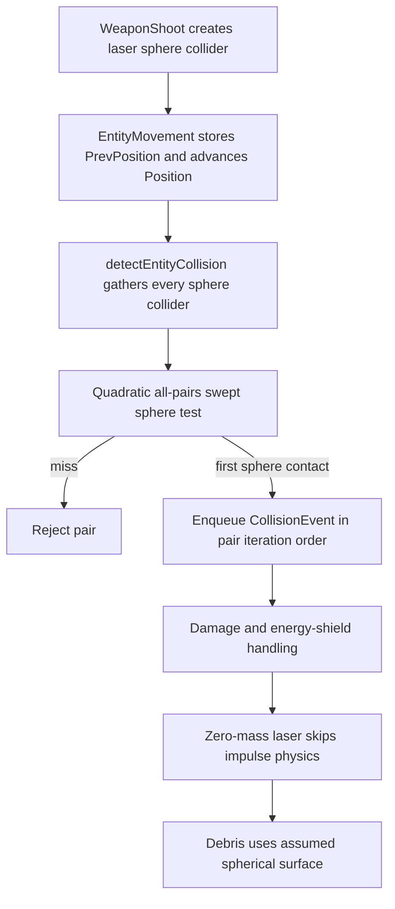
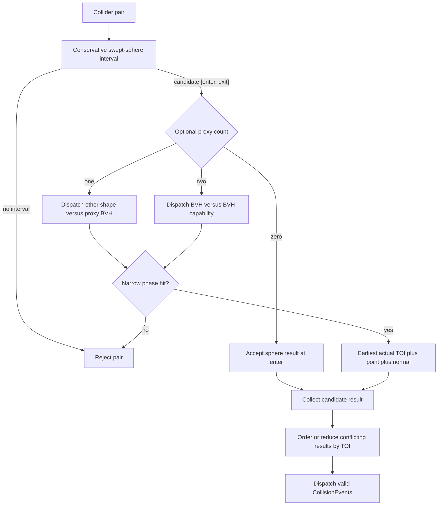

# TODO: BVH Collision Proxies

Status: **Not implemented.** This document records a future collision architecture and does not authorize implementation without a new approved plan.

## Objective

Retain the existing swept sphere as the universal broad phase and default physical approximation, while allowing selected entities to reference a separate simplified collision proxy. A shared model-space BVH will eventually accelerate accurate narrow-phase contacts for lasers and other explicitly supported collision shapes.

The collision proxy is a physics/query asset. It is not the render mesh, does not follow graphical LOD, and excludes texture-only detail.

## Current Collision Flow

The gameplay frame currently executes weapon shooting, entity movement, collision detection, and event dispatch in that order.

A laser is not a hitscan ray. It is a projectile entity with `CollisionBody`, `RenderBody`, `tag::Bullet`, `tag::bullet_type::Energy`, and `tag::bullet_type::Lazer`. Movement records `PrevPosition` and advances `Position`; the generic detector then treats the laser as a finite-radius sphere swept through the frame.

`ModelStrech` changes only the rendered laser model. It does not change collision geometry.



Current limitations:

- `calculateCollisionTime()` calculates both quadratic roots but exposes only the first accepted collision ratio.
- `CollisionEvent` stores entity-center positions and `collisionDtRatio`, but no explicit surface contact point or contact normal.
- Events are enqueued in ECS pair-iteration order rather than earliest-time order.
- The asteroid render surface may reach radius `1.05` while its nominal spherical collider remains radius `1.0` times entity scale.
- The detector checks every collider pair. This specification does not authorize changing that existing quadratic structure.

## Collision Representations

### Bounding sphere

`CollisionBody` remains mandatory. It owns:

- Cheap broad-phase rejection.
- The existing continuous swept-sphere behavior.
- Default physical collision when no more precise proxy is present.
- Conservative bounds for any optional narrow-phase shape.

Sphere-only entities retain current behavior and pay no proxy-query cost.

### Collision proxy

A future optional collision-proxy component will reference simplified geometry independent of `RenderBody`.

The proxy should contain gameplay-relevant surfaces such as large crater bowls, major ravines, hull boundaries, doorways, and hangar walls. It should exclude materials, textures, normal-map cracks, pores, grain, and graphical subdivision that does not affect gameplay contact.

Collision geometry must remain stable when rendering changes camera distance, material, shader, or LOD.

### Convex and compound shapes

Moving ships should continue with spheres until evidence justifies a more accurate shape. Convex or compound-convex proxies are preferable to dynamic concave meshes for ordinary rigid-body physics.

Triangle collision proxies are appropriate for detailed surface queries and static or kinematic structures such as hangars. A ship inside a hangar should normally be tested as a sphere, capsule, or convex shape against the hangar proxy rather than through general dynamic mesh-mesh collision.

| Use case | Intended representation |
|---|---|
| Universal broad phase | Existing swept sphere |
| Small asteroid | Sphere only unless evidence justifies more |
| Detailed asteroid laser impact | Sphere plus simplified triangle proxy |
| Moving spaceship | Sphere initially; convex or compound convex later if required |
| Static or kinematic hangar/station | Simplified triangle proxy with shared BVH |
| Ship inside hangar | Sphere/capsule/convex versus hangar proxy |
| Normal-map cracks, pores, and grain | Visual only |

## Broad-Phase Interval

A positive sphere result is a candidate, not necessarily a confirmed collision.

The future broad phase must return the complete sphere-overlap interval, clamped to the current frame:

```cpp
struct CollisionInterval {
    float enterRatio;
    float exitRatio;
};
```

`enterRatio` is the first time the conservative bounds overlap. `exitRatio` is the last time they overlap. If a pair has an optional proxy, its narrow phase must sweep throughout this interval rather than sample only the entry position.

The bounding sphere must conservatively enclose the collision proxy. A nominal radius of `1.0` cannot serve as the conservative bound for proxy geometry extending to `1.05` unless the bound is expanded or derived from cached proxy metadata.

## BVH Ownership and Lifecycle

- Collision proxies are generated or simplified offline.
- One immutable model-space BVH is baked offline or built once when each unique proxy is loaded.
- All entities referencing the same proxy share that BVH.
- Per-entity position, rotation, translation, and scale are applied at query time.
- Immutable proxy vertices and BVH nodes are never rebuilt per entity or frame.
- Runtime measurements must determine whether offline BVH serialization is justified; it is not assumed initially.

## Narrow-Phase Dispatch

Weapon code must not invoke collision algorithms directly. After sphere rejection, a collision-shape/query policy selects a focused narrow-phase handler.



Initial and future dispatch expectations:

- Sphere versus sphere: retain existing behavior.
- Swept sphere versus one proxy: query the BVH with the swept volume, test candidate triangles, and return the earliest triangle time of impact inside `[enterRatio, exitRatio]`.
- Laser versus proxy: preserve the laser's current finite-radius swept-sphere behavior. A segment/ray query is a deliberate approximation that can lose valid grazing hits and requires explicit approval.
- Capsule, convex, beam, or point-like queries: add focused handlers without weapon-name branches throughout the pair loop.
- Proxy versus proxy: traverse both BVHs only under a separately specified capability.
- Unsupported shape pairs: use an explicit fallback or rejection policy.

A BVH accelerates candidate discovery; it does not itself solve continuous collision. Dynamic or rotating proxy-versus-proxy time of impact remains a separate difficult problem and must not be represented as complete merely because BVH traversal exists.

## Earliest-Time Ordering

Each narrow phase must choose the earliest actual contact among all candidate triangles for its pair.

That is insufficient when one fast projectile crosses multiple entities during the same frame. Correct per-pair results can still be resolved incorrectly if events remain in ECS iteration order. A later collision can destroy the projectile before an earlier physical collision is processed.

A future implementation must explicitly select one of these policies:

- Retain only the earliest valid collision per projectile.
- Collect all results, order them by time of impact with a deterministic tie-breaker, and invalidate later results when earlier events change state.

The simpler projectile-specific reduction is likely the first appropriate increment. A globally ordered continuous-physics solver is broader work.

## Contact and Event Data

Entity-center positions must retain their existing meaning for damage and impulse calculations.

Accurate proxy contacts require separate event data:

- Earliest time-of-impact ratio.
- Surface contact point.
- Surface contact normal.

Debris, impact effects, and sounds may use the surface contact. Existing center-based physics must not silently reinterpret a party position as a surface point.

## Performance Requirements

- Never query proxy triangles before the sphere broad phase produces a candidate interval.
- Never build or refit immutable model-space BVHs per entity or frame.
- Cache one BVH per unique collision-proxy asset and reuse it across instances.
- Keep proxy triangle counts substantially below render-mesh triangle counts.
- Never couple collision results to camera-selected render LOD.
- Measure broad-phase candidate counts, BVH node visits, tested triangles, and narrow-phase time before considering parallelism.
- Do not place unaccelerated render-mesh tests inside the current all-pairs inner loop.

## Planned Implementation Increments

Each increment requires a new approved plan and red-first deterministic tests.

1. Characterize current swept-sphere behavior, event ordering, and laser collision semantics.
2. Introduce a robust clamped sphere-overlap interval without changing sphere-only results.
3. Define collision-proxy asset ownership and shared model-space BVH lifecycle.
4. Implement exact swept sphere-versus-proxy narrow phase.
5. Order or reduce fast-projectile collisions by earliest time of impact.
6. Propagate contact point and normal without changing entity-center physics semantics.
7. Profile candidate counts and proxy cost before enabling proxies broadly.
8. Treat convex shapes, hangar behavior, and proxy-versus-proxy collision as separately approved capabilities.

## Boundaries

Always:

- Retain a conservative sphere broad phase.
- Keep collision assets independent of rendering and LOD.
- Cache immutable acceleration structures per unique proxy.
- Preserve finite projectile radius unless an approximation is explicitly accepted.
- Return the earliest true contact inside the complete candidate interval.

Ask first:

- New shape types, public event changes, BVH dependencies or serialization, global collision ordering, parallelism, or runtime proxy enablement.
- Any change to the current all-pairs collision structure.
- Any approximation that replaces swept-sphere behavior with a point or ray.

Never:

- Rebuild a static proxy BVH per entity or frame.
- Use render LOD as collision LOD.
- Treat normal-map detail as implicit physical geometry.
- Run mesh narrow phases for pairs already rejected by their conservative spheres.
- Claim BVH traversal alone solves continuous dynamic mesh-mesh collision.

## Open Questions

- Which component owns the collision-proxy identifier and cached conservative radius?
- Should the first implementation reduce to one earliest hit per projectile or sort all candidates?
- Is runtime BVH construction fast enough, or should a later asset format serialize the BVH?
- Which imported formats and preprocessing tool will own external collision-proxy generation?
- What surface-error and triangle-count thresholds are acceptable for asteroids and hangars?
