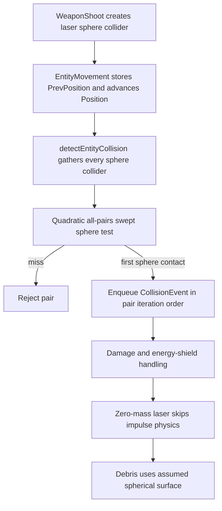
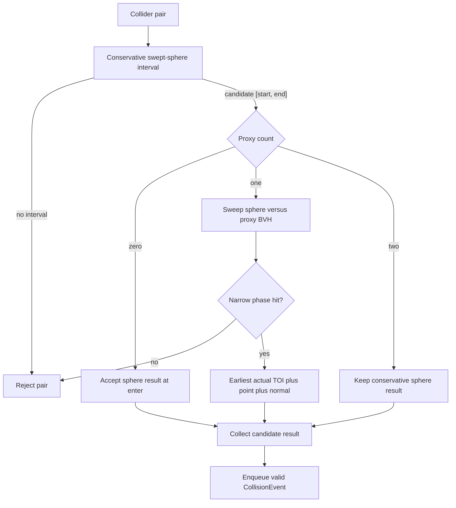

# BVH Collision Proxies

Status: **Initial implementation.** This document describes the current collision-proxy architecture, its invariants, and the capabilities that remain intentionally out of scope.

## Purpose

The collision system retains the swept sphere as the universal broad phase and default physical approximation. Selected entities may additionally reference a simplified collision proxy for more accurate narrow-phase queries. A shared model-space BVH accelerates those proxy queries without coupling collision geometry to rendering.

The collision proxy is a physics/query asset. It is not the render mesh, does not follow graphical LOD, and excludes texture-only detail.

The current implementation supports sphere-versus-sphere collision and swept sphere-versus-proxy collision. Proxy-versus-proxy continuous time of impact, contact-point events, and globally ordered event resolution are separate capabilities rather than implied consequences of loading a BVH.

## Runtime Collision Flow

The gameplay frame currently executes weapon shooting, entity movement, collision detection, and event dispatch in that order.

A laser is not a hitscan ray. It is a projectile entity with `CollisionBody`, `RenderBody`, `tag::Bullet`, `tag::bullet_type::Energy`, and `tag::bullet_type::Lazer`. Movement records `PrevPosition` and advances `Position`; the generic detector then treats the laser as a finite-radius sphere swept through the frame.

`ModelStrech` changes only the rendered laser model. It does not change collision geometry.



Current limitations:

- `calculateCollisionInterval()` returns the clamped sphere-overlap interval using `collisionStartDt` and `collisionEndDt`.
- `CollisionEvent` stores entity-center positions and `collisionDtRatio`, but no explicit surface contact point or contact normal.
- Events are enqueued in ECS pair-iteration order rather than earliest-time order.
- A mesh proxy can extend beyond the authored sphere, so the detector derives a conservative effective radius before the broad phase.
- The detector currently checks every collider pair; the all-pairs quadratic structure remains part of the current behavior.

## Collision Representations

### Bounding sphere

`CollisionBody` remains mandatory. It owns:

- Cheap broad-phase rejection.
- The existing continuous swept-sphere behavior.
- Default physical collision when no more precise proxy is present.
- Conservative bounds for any optional narrow-phase shape.

Sphere-only entities retain current behavior and pay no proxy-query cost.

### Collision proxy

`CollisionBodyModel` explicitly opts an entity into simplified geometry independent of `RenderBody`. The component stores only the `t_collision_mesh_id`; `CollisionBodyManager` owns the corresponding immutable CPU data and shared BVH.

The proxy should contain gameplay-relevant surfaces such as large crater bowls, major ravines, hull boundaries, doorways, and hangar walls. It should exclude materials, textures, normal-map cracks, pores, grain, and graphical subdivision that does not affect gameplay contact.

Collision geometry must remain stable when rendering changes camera distance, material, shader, or LOD.

### Convex and compound shapes

Moving ships currently use spheres. Convex or compound-convex proxies are preferable to dynamic concave meshes if ordinary rigid-body physics later needs a more accurate shape.

Triangle collision proxies are appropriate for detailed surface queries and static or kinematic structures such as hangars. A ship inside a hangar is normally tested as a sphere, capsule, or convex shape against the hangar proxy rather than through general dynamic mesh-mesh collision.

| Use case | Intended representation |
|---|---|
| Universal broad phase | Existing swept sphere |
| Small asteroid | Sphere only unless evidence justifies more |
| Detailed asteroid laser impact | Sphere plus simplified triangle proxy |
| Moving spaceship | Sphere initially; convex or compound convex later if required |
| Static or kinematic hangar/station | Simplified triangle proxy with shared BVH |
| Ship inside hangar | Sphere/capsule/convex versus hangar proxy |
| Normal-map cracks, pores, and grain | Visual only |

## Broad-Phase Interval

A positive sphere result is a candidate, not necessarily a confirmed collision.

The broad phase returns the complete sphere-overlap interval, clamped to the current frame:

```cpp
struct CollisionInterval {
    float collisionStartDt;
    float collisionEndDt;
};
```

`collisionStartDt` is the first time the conservative bounds overlap. `collisionEndDt` is the last time they overlap. If a pair has one proxy, its narrow phase sweeps throughout this interval rather than sampling only the entry position.

The detector's effective radius is the maximum of the authored `CollisionBody.radius` and the proxy bound after the current instance transform. The component is not mutated. A nominal radius of `1.0` cannot serve as the conservative bound for proxy geometry extending beyond it unless the bound is expanded or derived for that instance.

## BVH Ownership and Lifecycle

- Collision proxies are generated or simplified offline.
- One immutable model-space BVH is baked offline or built once when each unique proxy is loaded.
- All entities referencing the same proxy share that BVH.
- Per-entity position, rotation, translation, and scale are applied at query time.
- Immutable proxy vertices and BVH nodes are never rebuilt per entity or frame.
- Runtime measurements must determine whether offline BVH serialization is justified; it is not assumed initially.

## Narrow-Phase Dispatch

Weapon code does not invoke collision algorithms directly. After sphere rejection, a collision-shape/query policy selects a focused narrow-phase handler.



Current dispatch behavior:

- Sphere versus sphere: retain existing behavior.
- Swept sphere versus one proxy: query the BVH with the swept volume, test candidate triangles, and return the earliest triangle time of impact inside `[collisionStartDt, collisionEndDt]`.
- Laser versus proxy: preserve the laser's current finite-radius swept-sphere behavior. A segment/ray query is not used because it can lose valid grazing hits.
- Proxy versus proxy: retain the conservative sphere result; dynamic BVH-versus-BVH time of impact is not implemented.
- Other shape pairs: have no mesh narrow-phase handler until a focused capability is added.

A BVH accelerates candidate discovery; it does not itself solve continuous collision. Dynamic or rotating proxy-versus-proxy time of impact remains a separate difficult problem and must not be represented as complete merely because BVH traversal exists.

## Event Ordering

Each narrow phase must choose the earliest actual contact among all candidate triangles for its pair.

The detector currently enqueues valid pair results in ECS iteration order. This is sufficient for the current collision behavior but can resolve fast projectiles incorrectly when one projectile crosses multiple entities during the same frame: a later collision can destroy the projectile before an earlier physical collision is processed.

Possible future policies are:

- Retain only the earliest valid collision per projectile.
- Collect all results, order them by time of impact with a deterministic tie-breaker, and invalidate later results when earlier events change state.

Projectile-specific reduction is narrower than a globally ordered continuous-physics solver and should be evaluated separately.

## Contact and Event Data

Entity-center positions must retain their existing meaning for damage and impulse calculations.

Accurate proxy contacts require separate event data:

- Earliest time-of-impact ratio.
- Surface contact point.
- Surface contact normal.

Debris, impact effects, and sounds may use the surface contact. Existing center-based physics must not silently reinterpret a party position as a surface point.

## Performance Invariants

- Never query proxy triangles before the sphere broad phase produces a candidate interval.
- Never build or refit immutable model-space BVHs per entity or frame.
- Cache one BVH per unique collision-proxy asset and reuse it across instances.
- Keep proxy triangle counts substantially below render-mesh triangle counts.
- Never couple collision results to camera-selected render LOD.
- Measure broad-phase candidate counts, BVH node visits, tested triangles, and narrow-phase time before considering parallelism.
- Do not place unaccelerated render-mesh tests inside the current all-pairs inner loop.

## Design Decisions from the First Implementation

The first collision-proxy implementation exposed several rules that are easy to miss when the feature is described only as “load a mesh and test triangles.” These rules should remain stable as the architecture grows.

### Keep asset data, entity state, and query policy separate

`CollisionBodyManager` owns immutable CPU-side collision data such as triangles, bounds, and the shared BVH. `CollisionBodyModel` is an explicit entity opt-in that stores only the proxy identifier. `CollisionBody` remains the entity's authored physical sphere and is not replaced by the mesh asset.

The existence of a companion `.collision.obj` file must not silently attach collision behavior to every entity that happens to use the corresponding render model. Loading the proxy and adding `CollisionBodyModel` are separate, intentional operations. This keeps asset discovery from becoming an unexpected gameplay-side effect.

### Keep the broad phase conservative without mutating components

The sphere broad phase must use a transient effective radius that is at least as large as both the authored sphere and the transformed proxy bound:

```cpp
effectiveRadius = max(authoredRadius, transformedProxyRadius);
```

This value belongs to the detector's per-frame query snapshot. It must not overwrite `CollisionBody.radius`, because that component remains the authored physical data used by other systems and because the proxy bound depends on the current instance transform. A manager-level cache may store immutable model data, but an exact world-space radius can become stale when scale or rotation changes which vertex is furthest from the entity center.

The transformed-radius query is cheap enough to derive once per mesh entity while gathering collision data. It should not become a per-pair cache or a speculative transform-cache subsystem without profiling evidence.

### Apply each transform layer exactly once

Static model transforms belong to the immutable collision asset loaded by `CollisionBodyManager`. The entity's runtime `RenderBody` translation, scale, and current rotation belong to the per-instance collision query. `CollisionBodyModel` owns no independent transform; it follows the entity's transform contract.

The renderer and collision query must agree on how those layers are composed. A static transform that is already stored in the collision model must not be applied again at query time. Renderer-only effects such as laser stretch remain a deliberate approximation unless they are explicitly added to the collision representation.

### Treat closed proxies as volumes when containment matters

A surface-only sweep can miss a sphere that starts fully inside a closed mesh without touching a triangle and without moving far enough to create a surface root. The query therefore needs a point-in-volume check before the BVH surface sweep when the proxy is intended to represent a solid volume. The current winding/solid-angle test reports an initial hit at `collisionDt == 0` for a point inside a closed mesh.

The topology distinction is important: a point inside a non-convex donut hole has zero winding number and must remain outside, while a point inside the donut's solid tube must collide. This is not a license to treat arbitrary OBJ files as volumes. Containment semantics require a closed, consistently oriented, sufficiently manifold proxy; open or non-manifold assets need validation or an explicit surface-only policy.

### Test topology, not only contact distance

Collision-proxy regression tests should include ordinary square sweep hit/miss cases, a sphere fully enclosed in a solid fixture, a point in a non-convex hole, and a point in the solid part of that same non-convex fixture. These cases distinguish a genuine volume query from a surface-distance heuristic and protect against reintroducing the inside-mesh bug.

The current mesh-vs-mesh path remains a deliberate capability boundary: when both entities have proxies, the detector retains the conservative sphere result rather than implying that continuous dynamic BVH-versus-BVH time of impact has been solved. A shared BVH and a correct sphere-versus-mesh query are useful independently; they do not remove the need for a separately specified dynamic mesh-mesh algorithm.

## Invariants and Non-Goals

The following invariants define the current design:

- The sphere broad phase remains conservative and runs before triangle queries.
- Collision assets remain independent of rendering, materials, and graphical LOD.
- Immutable proxy data and BVH nodes are shared by all entities using the same asset.
- Runtime transforms are applied at query time; static transforms are applied exactly once.
- Finite projectile radius is preserved.
- A proxy query returns the earliest true contact inside the broad-phase interval.
- A closed proxy used for containment must be closed, consistently oriented, and sufficiently manifold.

The current design deliberately does not provide frustum-style collision culling, point/ray replacement for finite sweeps, general convex or capsule dispatch, serialized BVHs, globally ordered event resolution, or continuous dynamic mesh-mesh collision. Each is an independent extension with its own correctness and performance trade-offs.

## Verification Cases

The deterministic collision-proxy tests cover ordinary square hit/miss sweeps, transformed proxy bounds, a sphere whose center starts inside a closed solid fixture, a point in a non-convex donut hole, and a point inside the donut's solid tube. The containment cases are especially important: surface distance alone cannot distinguish a solid volume from an empty hole.
