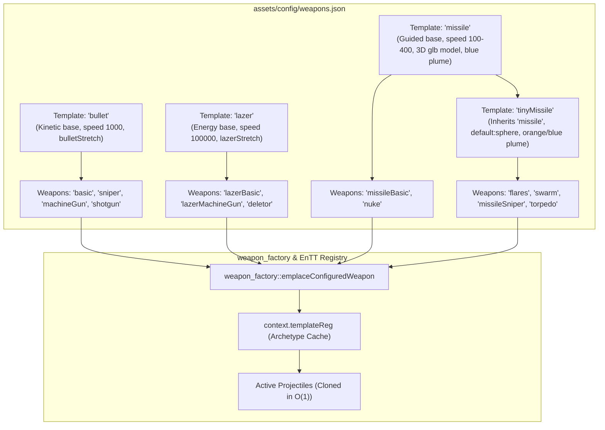

# Weapon Designer Handbook: Zero-Code Creation & Balancing Guide

This handbook is a complete, copy-paste-ready guide for **game designers, modders, and engineers** to create, tune, balance, and integrate brand-new weapons into **3D Space Shooter** without modifying or compiling any C++ engine code.

The entire weapon system is **100% data-driven**: you describe the weapon's turret mounting, projectile kinematics, homing behavior, audio, explosion FX, and ribbon trails in [`assets/config/weapons.json`](file:///d:/Users/user/GameProjects/shooting_game_3d/project/assets/config/weapons.json), equip it via [`assets/config/loadout.json`](file:///d:/Users/user/GameProjects/shooting_game_3d/project/assets/config/loadout.json) or the in-game 3D Hangar, and test it immediately.

---

## 1. Core Architectural Philosophies



### 1.1 Pure Data-Driven Architecture
- **Zero C++ Requirement:** New weapons, weapon templates, and balancing adjustments are defined entirely in [`weapons.json`](file:///d:/Users/user/GameProjects/shooting_game_3d/project/assets/config/weapons.json).
- **Archetype Caching:** The engine resolves weapon configurations once at startup, builds immutable projectile archetype entities in `context.templateReg`, and clones them into the world during combat with $O(1)$ EnTT sparse-set allocation.

### 1.2 Decoupled ECS Capabilities
- Weapons are **universal components**. They do not know or care who mounts them:
  - Player ship primary or special mounts
  - AI combat drones, interceptors, fighters, and capital motherships
  - Static orbital defense turrets
- Behavioral tags (`weapon::tag::Bullet`, `Missile`, `Lazer`, `Kinetic`, `Energy`) drive ECS systems (`system_detect_collision`, `system_update_trails`, `system_ai_shoot_control`) without hardcoded weapon name branches.

### 1.3 Recursive Multi-Tier Template Inheritance
- Weapons inherit fields from a parent template specified via `"template": "<parentId>"`.
- If no template is specified, standard weapons default to inheriting `"bullet"`.
- Inheritance is recursive (up to depth 8 with cycle detection):
  $$\text{weapons} \longrightarrow \text{tinyMissile} \longrightarrow \text{missile} \longrightarrow \text{bullet}$$
- **DRY Principle:** Weapons only need to define the specific fields they override (e.g. `ammo`, `cooldown`, `speedMultiplier`, `color`).

---

## 2. System Invariants & Rules

### 2.1 The Universal 1.0f Model Contract
> [!IMPORTANT]
> **Mandatory Rule:** All 3D projectile models—whether external `.glb` files or procedural primitives—MUST have a nominal local bounding radius of exactly `1.0f` centered at `(0.0, 0.0, 0.0)`.

- Projectile size in gameplay is controlled strictly by `"radius": <float>`.
- The engine scales the rendered model by multiplying the 1.0f base model by `radius`. Never attempt to pre-scale raw meshes to world dimensions.

### 2.2 Procedural Primitive Model URIs (`default:<primitive>`)
Instead of loading external 3D files from disk, weapons can use built-in procedural primitives via the `default:<primitive>` URI scheme:
- `"modelPath": "default:sphere"`: Procedural sphere mesh ($r = 1.0$).
- `"modelPath": "default:cube"` (or `"default:box"`): Procedural cube mesh ($2.0 \times 2.0 \times 2.0$, spanning $[-1, 1]$).
- `"modelPath": "default:cylinder"`: Procedural cylinder mesh ($r = 1.0, h = 2.0$).
- `"modelPath": "default:plane"`: Procedural quad plane ($2.0 \times 2.0$).
- Any file path (e.g. `"assets/Models/missile/missile.glb"`): Loads and caches an external 3D model.

### 2.3 Velocity Stretch Decoupling
In high-speed combat, projectiles can optionally stretch along their velocity vector to form visible tracer lines:
- `"bulletStretch": true`: Enables velocity stretching for kinetic bullets (stretches proportional to speed).
- `"lazerStretch": true`: Stretches energy beams across their travel distance ($1.0 / (2 \times \text{radius})$).
- `"modelStretch": <float>`: Custom stretch factor.
- **Unstretched 3D Spheres:** When none of these flags are present (such as in `tinyMissile`), the projectile renders as a **true, unstretched 3D round sphere** regardless of velocity.

### 2.4 Dynamic Ribbon Trail Pipeline (`HasSimpleTrail`)
Projectiles with `"trail": true` generate smooth GPU quad ribbons behind their flight path:
- **Dynamic Width Scaling:** If `"trailWidth"` is omitted, the engine automatically calculates trail width proportional to projectile scale:
  $$\text{trailWidth} = \max(0.15,\; \text{radius} \times 0.8)$$
- **Ribbon Properties:**
  - `"trailColor": [R, G, B, A]`: Ribbon color and opacity.
  - `"trailMaxAge": 0.30`: Lifespan of each trail node in seconds.
  - `"trailMaxNodes": 8`: Maximum segment history (memory/detail limit).
  - `"trailMinDistance": 1.0`: Minimum distance before dropping a new ribbon node.
  - `"trailEndWidth": 0.0`: Tapering width at the tail of the ribbon (0.0 = sharp tip).

### 2.5 Canonical Color Palette Invariant
All visual weapon effects align with the canonical 3-color palette:
- **Blue (`[102, 191, 255, 255]`):** Standard missile plumes, defensive shields, friendly telemetry.
- **Orange (`[255, 161, 0, 255]`):** Flares, explosions, critical hits, tactical alerts.
- **Red (`[255, 0, 0, 255]`):** Hostile weapons, high-threat indicators.
- **Green (`[0, 228, 48, 255]`):** Pure energy laser beams (canonical sci-fi beam exception).
- **Gray (`[130, 130, 130, 255]`):** Kinetic bullet tracers, micro-missile bodies.

### 2.6 Ammunition & Lifespan Invariants
- **Infinite Ammunition:** Set `"ammo": 0`. The weapon fires continuously governed only by `"cooldown"`.
- **Pre-Emptied Weapons:** Use `"initialAmmo": 0` with a positive `"ammo": N` (e.g. `bigBall`). The weapon starts empty until charged or reloaded in combat.
- **Reloading:**
  - `"ammoRegen": <rate>`: Regenerates ammo continuously (bullets per second).
  - `"reloadTime": <seconds>`: Full magazine reload delay after exhaustion.
- **Infinite / Remote Lifespan:**
  - Normal projectiles: `"lifespan": <seconds>`.
  - Tactical ordnance (e.g. `nuke`): Set `"lifespan": null` or $\le 0.0$. The projectile lives indefinitely until impact or remote detonation.

---

## 3. Configuration Reference (`weapons.json`)

### 3.1 Weapon & Turret Parameters

| Field | Type | Default | Description |
|---|---|---|---|
| `name` | `string` | `"Weapon"` | User-facing display name in hangar and HUD. |
| `template` | `string` | `"bullet"` | Parent template ID to inherit defaults from. |
| `turretRef` | `string` | `"basic_shooter"` | Turret model key from `turrets.json` mounted on spaceship hardpoints. |
| `isSpecial` | `boolean` | `false` | True if this weapon mounts in the secondary/special weapon slot. |
| `cooldown` | `float` | `0.2` | Minimum interval between shots in seconds. |
| `bulletCount` | `int` | `1` | Number of projectiles spawned per shot (spread burst). |
| `ammo` | `int` | `0` | Max ammo capacity (`0` = infinite). |
| `initialAmmo` | `float` | `ammo` | Ammo present upon spawning. |
| `ammoRegen` | `float` | `0.0` | Ammo regenerated per second. |
| `reloadTime` | `float` | `0.0` | Magazine reload delay in seconds when depleted. |
| `chargeTime` | `float` | `0.0` | Required charging duration before release (seconds). |
| `chargeColor` | `[r,g,b,a]` | Semi-transparent | Visual color ring while charging. |
| `extendFireRequest` | `float` | `0.0` | Seconds the AI or player automatically sustains fire after trigger tap. |
| `shootSoundType` | `string` | `"bullet"` | Built-in sound pool: `"bullet"`, `"lazer"`, or `"missile"`. |
| `sound` | `string` | `""` | Optional explicit WAV file path for custom shot sound. |

### 3.2 Projectile Kinematics & Physics

| Field | Type | Default | Description |
|---|---|---|---|
| `baseSpeed` | `float` | `1000.0` | Base projectile launch velocity (units/sec). |
| `speedMultiplier` | `float` | `1.0` | Multiplier applied to `baseSpeed`. |
| `spreadAngle` | `float` | Auto | Inaccuracy cone half-angle in radians. |
| `spreadMultiplier` | `float` | `1.0` | Multiplier applied to base angular spread. |
| `mass` | `float` | `0.0` | Physical mass for Newtonian impact recoil. |
| `acceleration` | `float` | `0.0` | Linear forward thrust acceleration (units/$\text{sec}^2$). |
| `turnSpeed` | `float` | `0.0` | Steering angular velocity in rad/sec (`0.0` = unguided). |
| `homing` | `boolean` | `false` | Enables autonomous radar target acquisition and tracking. |
| `suicidal` | `boolean` | `false` | Detonates automatically upon reaching target proximity. |
| `rotationVelocity`| `float` | `0.0` | Constant axial spin rate around travel axis (rad/sec). |
| `syncModelRot` | `boolean` | `false` | Automatically aligns 3D model orientation to flight velocity. |

### 3.3 Visual & Model Parameters

| Field | Type | Default | Description |
|---|---|---|---|
| `modelPath` | `string` | `"default:sphere"` | Primitive URI (`default:sphere`, `cube`, `cylinder`, `plane`) or `.glb` path. |
| `color` | `[r,g,b,a]` | `[255,255,255,255]` | Base diffuse color tint for the rendered projectile. |
| `radius` | `float` | `0.05` | World collision and visual radius (multiplies 1.0f base model). |
| `bulletStretch` | `boolean` | `false` | Stretches mesh along velocity vector into a tracer pill. |
| `lazerStretch` | `boolean` | `false` | Stretches energy beam along distance. |
| `modelStretch` | `float` | `0.0` | Custom stretch scaling override. |
| `trail` | `boolean` | `true` | Enables procedural ribbon smoke trail. |
| `trailColor` | `[r,g,b,a]` | `[130,130,130,255]` | Ribbon plume color and alpha. |
| `trailWidth` | `float` | $\max(0.15, 0.8r)$ | Ribbon ribbon width at source. |
| `trailEndWidth` | `float` | `0.0` | Ribbon width at tail (tapering). |
| `trailMaxAge` | `float` | `0.05` | Node retention duration in seconds. |
| `trailMaxNodes` | `int` | `2` | Maximum history vertices in ribbon buffer. |

### 3.4 Damage & Death FX

| Field | Type | Default | Description |
|---|---|---|---|
| `baseDamage` | `float` | `25.0` | Direct impact damage. |
| `damageMultiplier`| `float` | `1.0` | Multiplier applied to `baseDamage`. |
| `instantDamage` | `float` | `0.0` | Proximity blast damage applied on death. |
| `instantRadius` | `float` | `radius * 0.5` | Radius of instant proximity blast. |
| `explosionDamage`| `float` | `0.0` | Expanding shockwave damage. |
| `explosionFinalRadius`| `float` | `0.0` | Maximum radius of visual explosion sphere. |
| `explosionStartRadius`| `float` | `radius * 0.5` | Initial radius of visual explosion sphere. |
| `explosionDuration`| `float` | `0.5` | Duration of expanding explosion sphere in seconds. |
| `explosionColor` | `[r,g,b,a]` | `[255,161,0,255]` | Color of expanding fireball. |
| `delayedDamage` | `float` | `0.0` | Damage inflicted after delay (e.g. torpedo core burn). |
| `delayedDamageTime`| `float` | `40.0` | Delay in seconds before delayed damage applies. |
| `deathSound` | `boolean` | `false` | Plays explosion sound effect upon projectile death. |

---

## 4. Copy-Paste Recipe Catalog

### Recipe 1: Kinetic Vulcan Gatling
Rapid-fire autocannon firing high-velocity kinetic tracer rounds with physical impact recoil.
```json
"vulcanGatling": {
    "name": "Vulcan Gatling",
    "template": "bullet",
    "turretRef": "basic_shooter",
    "ammo": 120,
    "reloadTime": 3.0,
    "cooldown": 0.05,
    "bulletCount": 1,
    "baseSpeed": 1400,
    "baseDamage": 12,
    "spreadMultiplier": 2.5,
    "mass": 8.0,
    "color": [255, 220, 180, 255],
    "trailColor": [180, 180, 180, 180],
    "modelPath": "default:sphere",
    "bulletStretch": true
}
```

### Recipe 2: High-Precision Heavy Railgun
Long-range kinetic sniper rifle firing an ultra-fast armor-piercing projectile.
```json
"heavyRailgun": {
    "name": "Heavy Railgun",
    "template": "bullet",
    "turretRef": "heavy_mg_rifle",
    "ammo": 10,
    "reloadTime": 4.5,
    "cooldown": 1.8,
    "baseSpeed": 3500,
    "baseDamage": 350,
    "radius": 0.12,
    "spreadMultiplier": 0.05,
    "color": [200, 240, 255, 255],
    "trailColor": [102, 191, 255, 255],
    "trailWidth": 0.25,
    "trailMaxAge": 0.40,
    "trailMaxNodes": 12,
    "modelPath": "default:cylinder",
    "bulletStretch": true
}
```

### Recipe 3: Micro-Missile Swarm (`tinyMissile`)
Fires a volley of 4 unstretched round spheres that fan out and home in on targets with bright orange plumes.
```json
"swarm": {
    "name": "Missile Swarm",
    "template": "tinyMissile",
    "turretRef": "basic_shooter",
    "ammo": 3,
    "reloadTime": 15,
    "bulletCount": 4,
    "cooldown": 0.25,
    "isSpecial": true,
    "radius": 0.15,
    "speedMultiplier": 2.0,
    "spreadAngle": 0.785,
    "turnSpeed": 0.75,
    "lifespanMultiplier": 0.5,
    "trailColor": [255, 161, 0, 255],
    "trailWidth": 0.12,
    "explosionDamage": 50,
    "explosionFinalRadius": 1.5,
    "instantDamage": 0
}
```

### Recipe 4: Defensive Anti-Missile Flares
Spreads slow-moving, decoy flares designed to draw incoming hostile missiles.
```json
"flares": {
    "name": "Flares",
    "template": "tinyMissile",
    "turretRef": "basic_shooter",
    "ammo": 4,
    "reloadTime": 8,
    "bulletCount": 2,
    "cooldown": 0.2,
    "isSpecial": true,
    "targetable": true,
    "radius": 0.15,
    "speedMultiplier": 0.5,
    "spreadAngle": 1.571,
    "turnSpeed": 0.05,
    "lifespanMultiplier": 0.2,
    "trailColor": [255, 161, 0, 255],
    "trailWidth": 0.12
}
```

### Recipe 5: Heavy Anti-Capital Torpedo
High-speed, unguided bunker-buster projectile dealing massive instant hull penetration.
```json
"torpedo": {
    "name": "Torpedo",
    "template": "tinyMissile",
    "turretRef": "basic_shooter",
    "ammo": 40,
    "ammoRegen": 1.0,
    "cooldown": 0.1,
    "isSpecial": false,
    "mass": 2.5,
    "radius": 0.15,
    "speedMultiplier": 4.0,
    "turnSpeed": 0.0,
    "instantDamage": 125,
    "instantRadius": 0.075,
    "explosionDamage": 50,
    "explosionFinalRadius": 1.5,
    "trailColor": [102, 191, 255, 200],
    "trailWidth": 0.12
}
```

### Recipe 6: Tactical Nuclear Warhead
Persistent, slow-moving heavy ordnance that creates a colossal expanding shockwave.
```json
"nuke": {
    "name": "Nuke",
    "template": "missile",
    "turretRef": "basic_shooter",
    "ammo": 1,
    "reloadTime": 30,
    "isSpecial": true,
    "lifespan": null,
    "mass": 100,
    "radius": 2.0,
    "speedMultiplier": 0.5,
    "turnSpeed": 1.5,
    "trailWidth": 1.6,
    "trailColor": [102, 191, 255, 255],
    "instantDamage": 2500,
    "instantRadius": 5.0,
    "explosionDamage": 100,
    "explosionFinalRadius": 100.0,
    "explosionStartRadius": 2.0,
    "explosionColor": [0, 255, 255, 255]
}
```

---

## 5. Verification & Testing Workflow

After adding or modifying weapon definitions in [`assets/config/weapons.json`](file:///d:/Users/user/GameProjects/shooting_game_3d/project/assets/config/weapons.json):

### Step 1: Smoke Test
Verifies that all JSON definitions parse correctly, models resolve cleanly, and turrets mount properly on spaceships:
```bash
cmd /c wsl bash -lc "cd /mnt/d/Users/user/GameProjects/shooting_game_3d/project && make test-manual TEST=unit_spawn_smoke"
```

### Step 2: In-Game Gameplay Benchmark
Simulates active combat with thousands of live entities, verifying frame rate, ribbon rendering, homing logic, and collision handling:
```bash
cmd /c wsl bash -lc "cd /mnt/d/Users/user/GameProjects/shooting_game_3d/project && BENCHMARK_DURATION_SECONDS=6 make test-manual TEST=benchmark_gameplay"
```

### Step 3: Run Integration Test Suite
Guarantees that spaceship loadouts and weapon registries maintain full system integrity:
```bash
cmd /c wsl bash -lc "cd /mnt/d/Users/user/GameProjects/shooting_game_3d/project && make test-integration"
```
