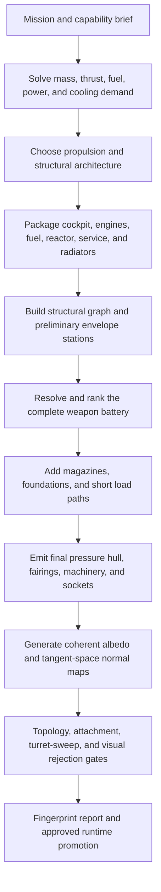

# Procedural Model Generation Workflow

## Purpose

This workflow covers the complete path from a model idea to an approved runtime asset:

1. Define its visual and gameplay constraints.
2. Design the generator and profile ownership.
3. Write deterministic, maintainable generator code.
4. Verify geometry, textures, and invariants with headless tests.
5. Generate controlled A/B candidates.
6. Capture comparable screenshot evidence.
7. Measure generation and rendering costs separately.
8. Review the asset in the actual game.
9. Promote only the approved candidate into canonical runtime assets.

This is a general workflow. Model-specific values, algorithms, and approved profiles belong in a model-specific specification such as [the procedural asteroid specification](../specs/procedural-asteroid-and-wsl-rendering.md).

Follow [model asset conventions](../model-asset-conventions.md) for coordinate, radius, collision-proxy, loading, and ownership contracts. Follow [development protocols](../development-protocols.md) for planning, approval, testing, scope control, and recovery.

## 1. Design the asset before designing the algorithm

Write a short visual brief before choosing noise functions, topology, texture resolution, or file structure.

The brief must define:

- The model's gameplay role.
- Its expected close, medium, and far viewing distances.
- Its canonical origin, orientation, and nominal dimensions.
- Its relationship to the broad-phase collision body.
- The silhouette and major landmarks that establish its identity.
- The material palette and important color regions.
- Whether variants share an algorithm or represent different concepts.
- Target triangle-count and texture-memory budgets.
- Required output formats and runtime material maps.
- Whether a separate collision proxy is required.

Treat these as asset invariants. Do not generate arbitrary geometry and compensate later in an entity factory, renderer, shader, or collision system.

Separate visual information by scale:

- **Macro:** silhouette, basins, major ridges, ravines, structural damage, or other landmarks visible at distance.
- **Medium:** craters, rocks, panels, cuts, material regions, and terrain transitions.
- **Micro:** pores, grain, tiny cracks, scratches, and surface roughness.

Geometry must carry silhouette and large structural changes. Normal maps carry lighting relief that does not need to change the silhouette. Albedo carries material identity and color variation. One representation must not be expected to conceal missing information in another.

## 2. Define the candidate matrix

Decide how quality and cost will be compared before implementation.

Change one major axis at a time:

| Pass | Fixed variables | Compared variable |
|---|---|---|
| Geometry | Seed, texture size, material settings | Triangle count or topology |
| Texture | Seed, geometry, feature settings | Texture resolution |
| Surface | Seed, geometry, texture resolution | Feature scale or normal strength |
| Runtime | Model, shader, camera, instance layout | Candidate asset |

Every candidate needs a stable name containing the information required to identify it. Do not use ambiguous names such as `new`, `final`, or `better`.

Recommended form:

```text
<model>_<profile>_<triangles>tri_<width>x<height>
```

Example:

```text
asteroid_big_720tri_2048x1024
```

## 3. Keep ownership explicit

Procedural model source belongs under:

```text
scripts/gen_model/
```

Canonical generated runtime assets belong under:

```text
assets/Models/<model>/
```

Disposable candidates, benchmark programs, measurements, screenshots, and inspection scripts belong under:

```text
../scratch/model-qc/<model>/
```

Scratch evidence must not be committed.

Use the existing ownership boundaries:

- `gen_types.hpp/.cpp` owns shared generator geometry, texture, and asset data types.
- A model generator owns shared geometry, feature-mask, normal, UV, and texture algorithms.
- A profile module owns every setting that defines one explicit model variant.
- `asset_writer` owns file serialization.
- Generator `main.cpp` owns command parsing and orchestration.
- `scripts/Makefile` owns offline-tool build rules.
- The root Makefile exposes only delegated entry points.
- `ModelManager` owns runtime loading, texture preparation, caching, and unloading.
- Entity factories select assets and compose components without processing model data.
- Renderers consume prepared assets without owning model-specific generation policy.

Do not redefine `Point2`, `Point3`, `Triangle`, `MeshData`, `TextureData`, or `AssetData` inside a model or collision module. Reuse `gen_model::gen_types`. If a shared type genuinely lacks required information, propose a focused extension to its canonical definition.

## 4. Structure shared algorithms and profiles

A model family with variants should normally use:

```text
<model>_generator.hpp
<model>_generator.cpp
<model>_<profile-a>.hpp
<model>_<profile-a>.cpp
<model>_<profile-b>.hpp
<model>_<profile-b>.cpp
```

The generator pair owns reusable algorithms. Each profile pair explicitly defines its complete policy.

Do not:

- Hide profile policy in aggregate defaults.
- Put every variant behind one large conditional branch.
- Let changing one profile silently alter another profile.
- Duplicate shared noise, topology, feature-mask, or texture algorithms.
- Create a god file containing unrelated model families.

Add abstractions only when they remove real duplication or establish a clear ownership boundary.

## 5. Follow the project C++ conventions

In headers, use the appropriate named namespace for declarations.

In `.cpp` files, define namespace-owned functions with fully qualified names:

```cpp
gen_model::asteroid::Settings gen_model::asteroid::big::settings() {
	gen_model::asteroid::Settings result;
	result.seed = 7331;
	return result;
}
```

Do not wrap namespace-owned `.cpp` definitions in a named namespace block.

Anonymous namespaces remain allowed for helpers that are private to one translation unit:

```cpp
namespace {
	float localFeatureSample(float x, float y) {
		return x * y;
	}
}

gen_model::gen_types::AssetData gen_model::asteroid::generate(
	const gen_model::asteroid::Settings& settings
) {
	// Shared generator implementation.
}
```

Additional quality requirements:

- Use guard clauses and failure-first validation.
- Keep functions focused and accurately named.
- Follow SRP, DRY, and KISS.
- Keep seeds and iteration order deterministic.
- Avoid hidden global mutable state.
- Avoid unnecessary allocations and full-size intermediate images.
- Reserve predictable vector capacity when topology determines the final size.
- Reuse shared feature calculations across geometry, albedo, and normal maps.
- Keep profile settings explicit and reviewable.
- Do not optimize unrelated existing code while adding a model.
- Record adjacent refactoring opportunities instead of expanding scope.

## 6. Write deterministic tests first

Generator tests belong in `tests/unit/` and use Catch2. They must remain headless and must not require a window, GPU, audio device, input, network, or runtime asset pack.

Use reduced texture dimensions in unit tests so deterministic behavior is verified without repeatedly generating production-sized maps.

Cover the relevant invariants:

- Identical settings and seeds produce identical output.
- Vertex and triangle counts match the requested topology.
- Every index is valid.
- Triangles are non-degenerate and consistently oriented.
- Vertex radii or dimensions remain inside the model-specific bounds.
- Normals are finite, normalized, and face outward where required.
- Shared vertices use the intended shared normals.
- UV and texture seams match.
- Texture dimensions and buffer sizes are correct.
- Albedo and normal maps contain meaningful variation.
- Invalid segment counts, dimensions, bounds, and settings are rejected.
- Profile modules expose their complete approved settings.
- Serialized OBJ, MTL, and texture references agree.

Run focused verification through WSL:

```sh
make test-unit
```

After implementation, run:

```sh
make test
make all
```

## 7. Implement from large structure to small detail

Implement in this order:

1. Topology and canonical dimensions.
2. Major silhouette variation.
3. Correct winding, indices, normals, and UV seams.
4. Shared macro and medium feature masks.
5. Albedo material identity.
6. Normal-map relief.
7. Microdetail.
8. Deterministic serialization.

This order prevents texture or normal-map detail from disguising incorrect geometry.

When geometry, normal mapping, and albedo depict the same crater, ridge, panel, or ravine, derive them from the same feature definition. Independent random layers drift apart and produce visually incoherent surfaces.

Normal strength must be chosen per material or profile. Do not compensate for weak asset identity by silently changing global game lighting.

### Engineering-first vehicle reference: generated spaceships

The spaceship generator is the reference implementation for procedural vehicles
whose appearance must follow mechanical purpose. Its central rule is:

> Design the machine that must work, then expose that engineering through a
> controlled silhouette. Do not begin with primitives and try to explain them
> afterward.

This distinction prevents the common failure where a hull, cockpit, engines, and
weapon sockets look like unrelated objects placed near one another. A successful
ship has a visible load path, believable internal volume, serviceable machinery,
clear heat rejection, and a weapon installation that belongs to its airframe.

#### Inputs describe capability, not finished coordinates

`assets/config/spaceships.json` owns the design brief. Automatic mode should be
driven by requirements such as:

- Core width, height, and length budget.
- Crew count and cockpit volume.
- Target acceleration, endurance, armor burden, and engine technology.
- Propulsion architecture preference or `auto` selection.
- Reactor, service-bay, radiator, and structural-spine policy.
- Turret count and each indexed turret's radius, barrel dimensions, traverse
  cone, coverage, symmetry, separation, support requirements, and optional
  `facingDirection`. Omitted facing means fixed local front (`+Z`); an explicit
  vector is fixed after normalization; `null` delegates direction to the
  coverage solver. The current catalog uses `null` only for Terminator.
- Role palette, broad paint pattern, normal strength, detail scale, and
  restrained wear policy.

In automatic mode, engine centers and weapon positions are resolved outputs. Do
not hand-tune stale coordinates until the ship looks acceptable. Manual placement
remains an explicit escape hatch when a design genuinely requires authored
geometry.

#### Solve the ship from the inside out

The current implementation follows this dependency order:



The stages have focused owners:

- `spaceship_config.cpp` parses the typed design brief and writes generation
  reports.
- `spaceship_design.cpp` solves performance, selects architecture, packages
  component volumes, builds their structural graph, and audits containment,
  balance, access, heat direction, and propulsion capacity.
- `spaceship_weapon_layout.cpp` treats mounts as indexed capabilities, constructs
  a bounded deterministic set of whole-battery candidates, rejects hard overlap
  failures, and ranks feasible layouts by coverage, separation, balance, and
  support length.
- `spaceship_envelope.cpp` turns functional modules into visible architecture:
  fuel housings, reactor shielding, cooling cassettes, service access, engine feed
  trunks, magazines, and dense-battery rails.
- `spaceship_mesh.cpp` owns mesh construction and real emitted-surface queries.
- `spaceship_generator.cpp` orchestrates final airframe emission, mount attachment,
  serialized-clearance inspection, albedo, normal mapping, and deterministic
  fingerprints.
- `asset_writer.cpp` serializes the final OBJ, MTL, albedo PNG, and normal PNG.
- `turret_clearance_gate.py` independently checks the serialized OBJ rather than
  trusting the in-memory generator.

#### Functional volume determines visible mass

Every protected module begins with a required capacity. Its chosen shape must be
expanded until the actual geometric volume satisfies that capacity; recording a
larger number without enlarging the shape is not packaging.

Use role-appropriate shape families rather than one universal primitive:

- Cockpit: faceted capsule or armored wedge.
- Fuel: ellipsoid or capped axial tank.
- Reactor: shielded sphere or armored cylinder.
- Engines: axial frustum or capped cylinder.
- Magazines and service bays: chamfered or tapered boxes.
- Foundations and feed paths: tapered beams.

Larger weapon burden increases magazine, reactor, cooling, fuel, and propulsion
demand. Faster small craft may trade endurance for compact tanks; heavy craft need
more engine cells and visibly larger machinery. Engine capacity must be expressed
by actual nozzle cells and housings, not only by a report value.

Thruster appearance is architecture-driven as well. `central_cluster` uses a
compact paired manifold, `spine_cluster` a stacked thrust spine, `twin_boom`
and `wing_nacelles` use separated nacelle retention/shield geometry,
`distributed_aft` uses a repeated armored exhaust wall, and
`capital_side_blocks` uses large side shrouds. The shared nozzle-cell solver
still determines capacity, but the rear housing, collar profile, and service
fairing must change with the selected propulsion layout so every ship does not
end in the same cylinder pattern. A tapered aft pressure volume closes the
hull behind the machinery instead of leaving a planar rear cap.

The exterior should not expose an unprotected reactor or raw propellant vessel on
a combat craft. Show their engineering consequences instead:

- A shallow armored fuel shoulder continuing into a fighter nacelle.
- Full ribbed tank housings on a capital ship.
- A central armored reactor shield and power-routing strip.
- Cooling panels seated on real structural skin.
- Service covers reachable from a plausible maintenance direction.
- Feed trunks that visibly connect the hull and engine pod.

If an attachment cannot find real emitted Armor or Structure at its planned
station, generation must fail. A guessed-height fallback creates floating details
that may pass numeric counting while failing the ship.

#### Preserve architecture while wrapping components

The envelope is not a convex hull, blob, or isotropic shrink-wrap. Such algorithms
erase engine pods, wing roots, service bays, and the load paths that give a ship
identity.

Build a continuous pressure hull around the core modules, then retain deliberate
separate structural grammars:

- Central cluster for compact general-purpose craft.
- Wing nacelles for broad multirole ships.
- Twin boom for fast craft with large aft machinery.
- Spine cluster for heavier fighters.
- Distributed aft machinery for dense gunships.
- Capital side blocks for carrier-scale packaging.

Fairings must transition from the hull into the component. They may alter the
silhouette, but they may not read as a cylinder, box, or thin rod pasted onto an
otherwise finished body. Mirror symmetric stations from one canonical sample so
triangulation noise cannot make left and right sides visibly disagree.

#### Design the whole weapon installation

Weapon mounts are not the ship's starting point. Resolve them only after a
preliminary structural surface exists, while reserving their magazines and load
paths before final envelope construction.

For sparse batteries, prefer a low tangent hemispheroid or direct blister grown
from the wing or hull. Its foundation and magazine should sit inside the local
structure. Avoid a dedicated cylinder, long pylon, or diagonal tentacle merely to
reach a configured coordinate.

For dense batteries, an external rail or shooter deck is valid because the rail
is itself a substantial repeated load-bearing structure. This is appropriate for
Mothership and Terminator-style silhouettes, not for a two- or four-gun fighter.

Score the complete battery, not each mount independently. Required checks include:

- Bilateral or radial balance according to policy.
- Turret-envelope and peer-barrel separation.
- Coverage direction and traverse cone.
- Fixed-facing requests are honored for the entire traverse cone; coverage
  policy cannot reverse a fixed mount to make a clearance check pass.
- Structural support length and socket ownership.
- Local parent-sphere clearance uses `length(position) - 1 - turretRadius`.
- No cockpit, engine, exhaust, heat, or maintenance keep-out conflict.
- No final swept barrel envelope intersects any serialized mesh triangle over
  the complete configured traverse cone. The in-process and independent gates
  use the same dense deterministic lattice (64 azimuth samples across eight
  radial rings, plus the cone center) with a positive clearance margin; the
  75%/100% tip probes remain diagnostics, not a substitute for the cone gate.

Keep mount identity positional: callers consume the ordered mount vector. An ID
such as `mount_0` is diagnostic metadata, not a gameplay coordinate selector.

#### Separate detail by physical scale

Use all three representation layers deliberately:

- **Macro geometry:** pressure hull, cockpit volume, engine banks, tanks, reactor
  armor, wings/booms, cooling blocks, weapon decks, and load paths.
- **Medium geometry and normal relief:** access covers, broad seams, louvers,
  radiator rhythm, armor transitions, and manufactured surface direction.
- **Micro normal/albedo:** rolled or milled grain, restrained scratches, shallow
  paint loss, and rare corrosion at credible features.

Albedo does not make a flat shape mechanically detailed, and random geometry does
not make a coherent ship. Derive albedo and normal features from the same masks so
paint borders, recessed seams, louvers, and wear agree.

Use broad role-specific color blocking instead of a tiled grid. The approved
fleet uses spine bands, chevrons, wing bands, blocked industrial regions, and
hazard accents. Canopy glass remains smooth and unobstructed; vents or frames that
do not change silhouette belong in the texture/normal layers rather than as metal
clipped through the glass.

Wear must follow engineering exposure. Prefer sparse paint loss or oxidation at
crevices, drainage traps, heat zones, exposed fasteners, and difficult maintenance
areas. Suppress random rust speckles across accessible flat panels. “Used but
maintained” means the coating carries history without making the vehicle look
abandoned.

#### Reject failures instead of rationalizing them

The following are known failure modes, not acceptable stylistic variants:

- A generic aerodynamic body with engines and sockets pasted onto it.
- Thin rods or tentacles used to satisfy mount coordinates.
- Turrets arranged in a convenient line without checking their forward firing
  state and peer interference.
- A cockpit frame modeled as solid metal crossing the glass.
- Floating radiator, fuel, or service objects positioned from guessed heights.
- A dense orthogonal panel grid used as shorthand for “metal.”
- Uniform random rust, paint loss, or texture noise.
- Thrusters whose visible machinery cannot plausibly provide the reported thrust.
- Open wing edges, missing rear caps, non-manifold seams, or inside-out faces
  hidden by a favorable camera angle.
- Passing automated metrics while the complete ship still looks ugly, unbalanced,
  upside down, or mechanically incoherent.

Numerical gates are necessary but cannot approve beauty. A candidate that looks
wrong must be revised even when every assertion passes.

#### Required spaceship generation and QA loop

Generate the six deterministic candidates from WSL:

```sh
make gen_spaceships
```

The command writes fingerprinted candidates under:

```text
../scratch/model-qc/spaceships/<ship>_<settings-fingerprint>/
```

Each directory must contain:

- `spaceship_<ship>.obj`
- `spaceship_<ship>.mtl`
- `spaceship_<ship>.png`
- `spaceship_<ship>_normal.png`
- `generation_report.json`

The report is the promotion boundary. It records mesh bounds, design metrics,
visible system counts, normal/material coverage, resolved engines, resolved mount
geometry, and per-mount structural/clearance evidence.

Before approval, render every ship both body-only and armed from front, rear,
side, top, and an upright three-quarter camera. The armed overlay must use the
resolved report data and the configured turret/barrel dimensions. A front or side
view must move the camera; do not rotate the ship upside down to fake the view.

Promotion requires all of the following:

1. Deterministic unit and integration tests pass.
2. Serialized OBJ topology and MTL dependencies are valid.
3. The independent turret sweep gate passes all ships.
4. All 60 final views are inspected and no ugly or unexplained shape is waived.
5. The user explicitly approves the exact fingerprinted candidates.
6. Approved OBJ/MTL/albedo/normal files are copied byte-for-byte into
   `assets/Models/spaceships/<ship>/`.
7. `runtime.modelRadius`, `engines[]`, and `mounts[]` are updated from the same
   generation report. The runtime must never use stale geometry from an earlier
   candidate. Automatic design inputs stay separately under
   `design.weaponLayout.capabilities`; never feed resolved socket or support
   dimensions back into the generator as capabilities.
8. Candidate and canonical hashes match, followed by `make test` and `make all`.

Generated spaceships are authored in local parent-radius-1 units. Their resolved
engines, mounts, turret dimensions, and OBJ vertices share those coordinates;
`spaceship::factory` then uniformly scales the whole assembly by the caller's
requested positive radius and assigns that same radius to `CollisionBody`.
`runtime.modelRadius` is bounds metadata, never a scale divisor. Visible wings,
engines, and structural systems may extend beyond the gameplay sphere, but every
turret collision sphere must remain outside the local parent sphere and every
barrel must pass the full serialized-mesh sweep gate.

## 8. Generate candidates outside canonical assets

The canonical generator entry point is:

```sh
make gen_model
```

For experiments, use the built generator with an output directory under workspace `scratch/`. The current asteroid CLI supports explicit profile, topology, and texture overrides:

```sh
./objs/scripts/gen_model/gen_model \
	--profile big \
	--latitude 16 \
	--longitude 24 \
	--texture-width 2048 \
	--texture-height 1024 \
	--output-dir ../scratch/model-qc/asteroid/big_720tri_2048x1024 \
	--basename asteroid_big_720tri_2048x1024
```

Do not overwrite canonical assets while exploring candidates. Promote a candidate only after review and explicit approval.

For each candidate, record:

- Seed and complete profile settings.
- Vertex and triangle counts.
- Minimum and maximum dimensions or radius.
- OBJ and texture file sizes.
- Generator wall time.
- Peak generator memory when measured.
- Texture resolution and estimated or measured GPU memory.

Generator wall time is tool performance, not render performance.

## 9. Capture comparable screenshot evidence

Screenshot comparison requires controlled conditions. A flashed window or memory of a previous candidate is not sufficient evidence.

Keep the capture harness under scratch and fix:

- Window resolution.
- Camera position, target, up vector, and field of view.
- Model position, scale, and rotation.
- Shader and material preparation.
- Light position, color, and intensity.
- Background color.
- Mipmap and filtering behavior.
- Warm-up frame count.

If the scratch harness does not reproduce runtime material preparation, document that limitation and confirm the finalist inside the game.

For an A/B matrix, capture one identical hero view for every candidate. For finalists, capture:

1. Close three-quarter view for texture, normal-map, and faceting inspection.
2. Opposite close view so one favorable lighting angle cannot hide defects.
3. Medium-distance view for material identity and medium landmarks.
4. Far-distance view for silhouette and macro-feature retention.
5. Repeated-instance stress view when the model will appear many times.
6. Actual in-game view using the canonical shader, camera, brightness, and scale.
7. Canonical rear view for directional vehicles so hull caps, exhaust surrounds,
   trailing edges, and embedded component roots cannot be hidden by favorable angles.

Use filenames that identify the candidate and view:

```text
<model>_<profile>_<triangles>tri_<width>x<height>_<view>.png
```

Examples:

```text
asteroid_big_720tri_2048x1024_close.png
asteroid_big_720tri_2048x1024_far.png
asteroid_big_720tri_2048x1024_stress100.png
```

When presenting screenshots for review, provide their absolute file paths so each image can be opened directly.

## 10. Perform visual QC

Review geometry:

- Does the silhouette communicate the intended scale and identity?
- Are topology edges, poles, seams, or faceting conspicuous?
- Do large landmarks survive medium and far viewing distances?
- Does the model remain inside its authored dimensional contract?
- Are exterior caps and embedded component roots closed and consistently wound?

Review normal mapping:

- Does close-up relief remain continuous instead of becoming flat or mosaic-like?
- Does normal mapping preserve medium and macro landmarks?
- Is microdetail allowed to fade without removing the model's identity?
- Is the normal map hiding a topology defect that should be fixed in geometry?

Review albedo:

- Are major regions distinguishable without relying entirely on lighting?
- Do craters, ravines, stones, panels, or damage have material identity?
- Does the model look uniformly painted, toy-like, or incorrectly scaled?
- Are seams visible?

Review integration:

- Is the model readable under the actual game lighting?
- Is entity tint or brightness appropriate without destroying its texture?
- Does runtime scale match the nominal asset convention?
- Does the visual model stay inside the intended broad-phase proxy?
- Are mipmaps and filtering preserving the correct detail hierarchy?

## 11. Measure runtime cost separately

Benchmark the usage pattern that matters to the game. A repeated environment object should be tested with a fixed repeated-instance scene, not inferred from a single close-up.

Keep these measurements separate:

- Generator wall time and peak memory.
- Full frame latency.
- Synchronized render latency.
- Derived FPS.
- GPU texture memory or a clearly labeled estimate.
- Model and texture file sizes.

Use identical scene layout, camera, shader, lighting, resolution, warm-up, and sample count for every candidate.

If `glFinish()` is used, report the result as synchronized GPU-plus-driver render time. Do not label it as a pure GPU timer-query measurement.

Performance results do not select a candidate automatically. The approved candidate must satisfy both the measured budget and visual QC.

## 12. Promote the approved candidate

After explicit approval:

1. Apply the selected settings to the owning profile module.
2. Update deterministic tests for the approved invariants.
3. Generate canonical assets with `make gen_model`.
4. Run `make test`.
5. Run `make all`.
6. Capture a final in-game screenshot.
7. Review the Git diff for source, tests, documentation, and generated runtime assets.
8. Confirm no scratch harnesses, measurements, plans, or screenshots entered the repository.

Generated files required by the runtime are source assets and may be tracked. Compiler outputs and experimental evidence remain untracked.

If a collision proxy is requested, generate it only after the visual model exists. Keep collision preprocessing independent from visual generation:

```sh
make gen_collision INPUT=assets/Models/<model>/<model>.obj
```

The current collision generator is a passthrough skeleton. Do not claim simplification, topology repair, or BVH preprocessing until those capabilities are separately implemented and verified.

## Quality gates

A procedural model is complete only when:

- The visual brief and invariants are explicit.
- Shared algorithms and profile policy have clear owners.
- Common generator types are reused.
- Deterministic headless tests pass.
- Canonical dimensions and topology are verified.
- Comparable screenshot evidence exists.
- Close, medium, far, stress, and in-game views are reviewed where relevant.
- Generation and runtime performance are reported separately.
- The user explicitly approves the selected candidate.
- Canonical assets are regenerated and the repository contains no scratch evidence.
